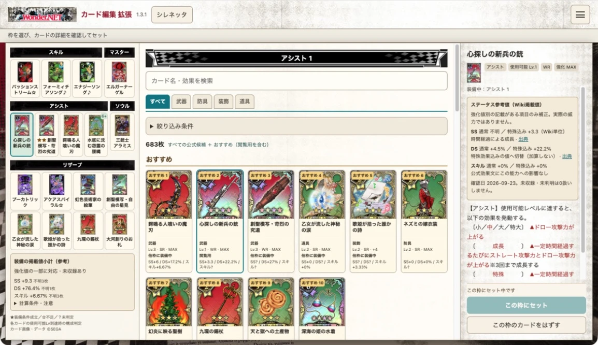

# WonderLandDeck

Wonder.NET（ワンダーランドウォーズ）のカード編集を1画面で行う、非公式のブックマークレットです。起動用ブックマークレットがGitHub Pagesから本体JSと参考値JSONを読み込みます。開発環境は不要です。

## 使う

**[導入ページで登録コードをコピー](https://satokoyo.github.io/wlw/)**

ページ公開前は [登録用コード](dist/wonder-deck.bookmarklet.txt) を開き、GitHubの「Copy raw file」で全文をコピーできます。ダウンロードした `dist/index.html` を直接開く方法も使えます。

1. コピーしたコードをChrome・SafariのブックマークのURLに登録します。
2. Wonder.NETにログインしてカード編集画面を開きます。
3. 登録したブックマークを実行します。



PC版Chromeでの表示例（v1.1.2）。画像・ゲームデータ ©SEGA。

- 名前付きで最大55文字のコードでキャストの構成を共有・インポート
- デッキ・おすすめ・検索結果・カード効果をまとめて表示
- カード変更やキャスト切り替え後も続けて編集
- 枠の装備制限、装備済みカードの交換、保存前後のサーバー照合
- 左カラムに、そのカードの対応する装備条件を★／☆／？で表示

[使い方](docs/usage.md) · [検証結果と未確認事項](docs/verification.md) · [設計メモ](docs/design-notes.md) · [公開前確認](docs/publication-review.md)

iPhone Safari実機での起動・保存は未確認です。★は対応する装備構成条件の判定で、試合中の全効果の発動を保証する表示ではありません。

## 構成

```text
src/wonder-deck.js              編集するソース
scripts/build.cjs               配布物を生成するスクリプト
tests/wonder-deck.test.cjs       Node.js標準テスト
site/index.template.html        導入ページのテンプレート
site/assets/                    掲載用の画面キャプチャ
dist/                          コミット済み配布物・Pages配信対象
docs/                          操作手順・設計・検証記録
.github/workflows/pages.yml     Pages配信設定
```

`dist/`は生成物です。ソースやテンプレートを変更してから再生成してください。`work/`、認証情報、APIの生データ、依存環境は配布対象に含めません。

## ビルド・テスト

Node.js 18以降を使い、リポジトリ直下で実行します。標準ビルドに追加パッケージは必要ありません。

```sh
node scripts/build.cjs
node --test tests/*.test.cjs
```

標準ビルドは短い起動コードと本体JS、単体版を生成します。既存のPlaywrightに含まれるBabel bundleがある場合のみ、`node scripts/build.cjs /path/to/playwright/lib/transform/babelBundle.js` で空白・コメントを削減できます。この任意機能はPlaywright内部APIに依存します。圧縮ツールがない場合も標準ビルドを利用できます。`dist/wonder-deck.min.js` は本体JSで、標準ビルドでは非圧縮です。

画面キャプチャは導入HTML内に埋め込みます。画像用の外部通信や追加配信設定は不要です。ブックマークレットのサイズには影響しません。

## GitHub Pagesで公開する

1. 公開範囲とプランを確認します。GitHub Freeでは公開リポジトリが必要です。リポジトリを公開するとソースと履歴も閲覧可能になります。
2. Settings → Pages → Source を **GitHub Actions** にします。
3. Actions → **Publish installation page** を実行します。
4. `https://satokoyo.github.io/wlw/` を確認します。

以降は `main` の配布物などの変更でテストと公開処理が実行されます。Pagesには `dist/` だけを配信します。現在の設定状態はGitHubのSettingsとActionsで確認してください。

SourcetreeのOAuth認証に `workflow` 権限がない場合、ワークフローの追加・変更はGitHubのWeb画面で行い、ローカルへpullします。本体の通常更新に権限追加は不要です。

[GitHub Pages公式手順](https://docs.github.com/en/pages/quickstart)

## 通信・権利表記

ブックマークレットのAPI通信先はWonder.NETの同一オリジンです。ログイン中のセッションを使い、カード変更キーは実行中に取得します。認証情報の固定埋め込み、外部解析サービスはありません。参考値JSONと本体JSはGitHub Pagesから取得します。

本ツールはSEGA公式ではありません。ゲーム名・カード画像・ゲームデータなどの権利は各権利者に帰属します。掲載キャプチャは操作説明用です。第三者素材の再利用権を許諾するものではありません。本リポジトリで作成したコード・説明文は [MIT License](LICENSE) です。著作権表示とライセンス文を残せば、商用利用・改変・再配布・組み込みを自由に行えます。改変したコードを公開する義務はありません。無保証で提供します。

MITライセンスは、SEGA等の第三者に権利があるゲーム名・画像・ゲームデータ・キャプチャ内の素材には適用されません。これらの再利用権を付与するものではありません。

## 参考値表示と短縮版（v1.2.0）

短縮版は約1.8千文字です。導入ページのコードを再登録してください。バージョン固定の本体JSを整合性検証（SRI）付きで取得します。次のバージョンへ移行する際は再登録が必要です。外部JSがブロックされる場合は [単体版](dist/wonder-deck.standalone.txt) も利用できます。

SS・DS・スキル攻撃力の掲載値をカード一覧・詳細・左カラムの小計に表示します。想定Lvと特殊効果の発動仮定を切り替えられます。現在の強化値には未補正で、未収録・未知の低下値を含まない参考小計です。実際の威力や効果発動の保証ではありません。初版は182カード・208項目を収録。[出典・データ更新方法](data/README.md)。

参考JSONは起動時に1度取得し、入れ替え・検索時には再取得しません。取得失敗は編集機能を停止させません。data/reference-stats.jsonを編集した際もビルドしてdistを更新してください。

## v1.3.0

中央のおすすめ限定・並び順・全解除を絞り込み内へ移動し、選択条件を件数の横へまとめました。参考データは318カード・363項目に拡充。低下値、対応する装備条件と想定Lv、明記された一部の強化値を反映し、概算は≈で表示します。未収録・未補正は残るため実ダメージではありません。新しい起動コードを導入ページから再登録してください。

特殊効果の最大成長・条件達成を仮定する設定を初期ONにしました。低下効果も反映します。公式形式の効果文が取得でき、その能力への影響がないと保守的に判定できる場合は0と表示します。汎用の攻撃力強化・未知の略号・文面不足は不明のままです。特殊分だけの掲載値は、基本効果にその能力の上昇がないと公式文から確認できる場合のみ合計へ反映します。

大河創りのお札の旧HP条件SS強化は、[アシスト性能評価](https://w.atwiki.jp/wlws/pages/769.html)の現行説明と照合し除外しました。掲載値一覧間で食い違う場合があるため、全カードの実測精度を保証するものではありません。
